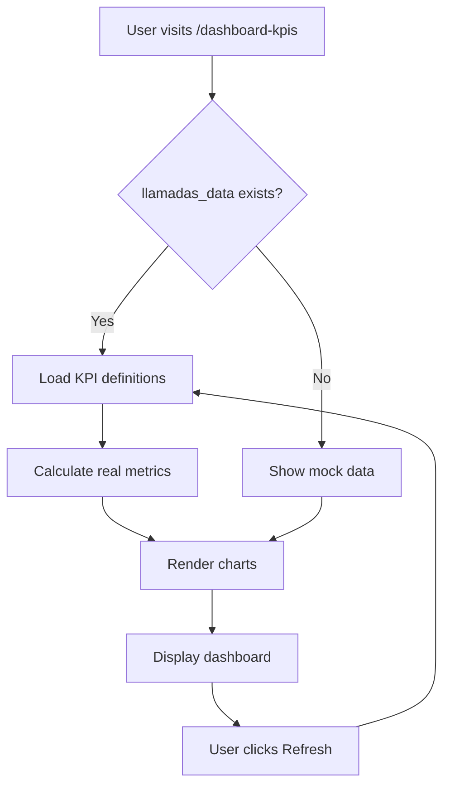

# 📊 Dashboard KPIs - Quick Start Guide

## 🚀 Access the Dashboard

1. **Navigate to any client**:
   ```
   http://localhost:3000/clientes/techcorp/dashboard-kpis
   http://localhost:3000/clientes/buffalo-demo/dashboard-kpis
   ```

2. **Or use the sidebar navigation**:
   - Login to the application
   - Select a client (techcorp, startupx, or buffalo-demo)
   - Click "**Dashboard KPIs**" in the "Agentes de Llamadas" section

---

## 📋 What You'll See

### Section 1 - Individual Metrics (3 Cards)
```
┌─────────────────────┬─────────────────────┬─────────────────────┐
│ 📞 1,234            │ ⏱️ 4:30             │ 💰 €1,500.50        │
│ Número total de     │ Duración media de   │ Costo total de      │
│ llamadas            │ las llamadas        │ las llamadas        │
└─────────────────────┴─────────────────────┴─────────────────────┘
```

### Section 2 - Line Charts (2 KPIs in 2 columns)
```
┌──────────────────────────────┬──────────────────────────────┐
│ 📈 Evolución del número de   │ 📈 Evolución de duración     │
│ llamadas por día             │ media por día                │
│ [LINE CHART]                 │ [LINE CHART]                 │
└──────────────────────────────┴──────────────────────────────┘
```

### Section 3 - Vertical Bar Charts (1 KPI)
```
┌──────────────────────────────┬──────────────────────────────┐
│ 📊 Distribución de motivos   │                              │
│ de desconexión               │                              │
│ [VERTICAL BAR CHART]         │                              │
└──────────────────────────────┴──────────────────────────────┘
```

### Section 4 - Donut Charts (4 KPIs in 2 columns)
```
┌──────────────────────────────┬──────────────────────────────┐
│ 🍩 Sentimiento del usuario   │ 🍩 Estado de interés en      │
│ en las llamadas              │ entrevista                   │
│ [DONUT CHART]                │ [DONUT CHART]                │
├──────────────────────────────┼──────────────────────────────┤
│ 🍩 Situación laboral de los  │ 🍩 Preferencia de turno de   │
│ usuarios contactados         │ contacto                     │
│ [DONUT CHART]                │ [DONUT CHART]                │
└──────────────────────────────┴──────────────────────────────┘
```

### Section 5 - Horizontal Bar Charts (3 KPIs in 2 columns)
```
┌──────────────────────────────┬──────────────────────────────┐
│ 📊 Distribución de agentes   │ 📊 Antigüedad laboral de     │
│ por número de llamadas       │ los usuarios                 │
│ [HORIZONTAL BAR CHART]       │ [HORIZONTAL BAR CHART]       │
├──────────────────────────────┴──────────────────────────────┤
│ 📊 Nivel de estudios de los usuarios contactados            │
│ [HORIZONTAL BAR CHART]                                       │
└──────────────────────────────────────────────────────────────┘
```

**Total: 13 KPIs displayed across 5 sections**

---

## ⚡ Quick Setup (If First Time)

### Option 1: Test with Mock Data (Instant)
Just access the dashboard - mock data loads automatically if database is not ready!

### Option 2: Use Real Data (Recommended)

```bash
# 1. Create the llamadas_data table
npm run db:create-llamadas

# 2. (Optional) Insert sample data
# You'll need to populate the table with actual call data

# 3. Access the dashboard - real data will load!
```

---

## 🎯 Key Features

### ✅ What Works Out of the Box:
- ✅ Mock data for testing (automatically loads)
- ✅ All 5 chart types render correctly
- ✅ Responsive design (mobile, tablet, desktop)
- ✅ Refresh button to update metrics
- ✅ Error handling with friendly messages
- ✅ Loading states with spinners
- ✅ Integrated navigation
- ✅ Client theme colors applied

### 📊 Chart Types Available:
1. **Individual Cards** - Big numbers with icons
2. **Line Charts** - Trends over time
3. **Vertical Bar Charts** - Category comparisons
4. **Horizontal Bar Charts** - Rankings
5. **Donut Charts** - Proportions/percentages

---

## 🔄 How Data Flows



---

## 📱 Responsive Breakpoints

### Desktop (lg: 1024px+)
- Individual cards: **3 columns**
- Charts: **2 columns**

### Tablet (md: 768px+)
- Individual cards: **2 columns**
- Charts: **1-2 columns**

### Mobile (< 768px)
- Individual cards: **1 column**
- Charts: **1 column**

---

## 🎨 Color Palette

### Metric Card Icons:
- 🔵 Blue (#3b82f6)
- 🟢 Green (#10b981)
- 🟣 Purple (#8b5cf6)
- 🟠 Orange (#f59e0b)
- 🔴 Pink/Red (#ef4444)

### Charts:
- **Line Charts**: Blue line (#3b82f6)
- **Bar Charts**: Multi-color (blue, green, orange, red, purple)
- **Donut Charts**: Green, Red, Blue, Gray

---

## 🛠️ Customization Examples

### Change Chart Height
**File**: `app/clientes/[clienteId]/dashboard-kpis/page.tsx`

Find:
```typescript
<ResponsiveContainer width="100%" height={300}>
```

Change to:
```typescript
<ResponsiveContainer width="100%" height={400}>
```

### Change Card Grid Columns
Find:
```typescript
className="grid grid-cols-1 md:grid-cols-2 lg:grid-cols-3"
```

Change to:
```typescript
className="grid grid-cols-1 md:grid-cols-3 lg:grid-cols-4"
```

### Add Custom KPI
See **DASHBOARD-KPIS-SETUP.md** → "Customization" section

---

## 📊 Data Source

### KPI Definitions:
- **Database**: `crear_kpis` table
- **Column**: `kpis` (TEXT[] array)
- **Format**: JSON strings

Example:
```json
{
  "titulo": "Número total de llamadas",
  "descripcion": "Muestra el número total...",
  "tipo_grafico": "individual",
  "num_inputs": 1,
  "inputs": ["id"],
  "ejemplo": "Un número grande..."
}
```

### Actual Data:
- **Database**: `llamadas_data` table
- **Columns**: id, agent_name, duracion_ms, fecha_inicio, sentimiento, etc.
- **Total**: 28 columns

---

## 🚨 Common Issues & Solutions

### Issue: Dashboard shows mock data
**Solution**: Create `llamadas_data` table
```bash
npm run db:create-llamadas
```

### Issue: Navigation link missing
**Solution**: Restart dev server
```bash
# Press Ctrl+C to stop
npm run dev
```

### Issue: Charts not rendering
**Solution**: Check browser console for errors, verify Recharts is installed

### Issue: All values show 0
**Solution**: Insert data into `llamadas_data` table

---

## 📚 Full Documentation

For complete details, see:
- **DASHBOARD-KPIS-SETUP.md** - Complete technical documentation
- **database/LLAMADAS-TABLE-DOCUMENTATION.md** - Database schema
- **database/CREATE-LLAMADAS-README.md** - Table creation guide

---

## 🎉 You're Ready!

The dashboard is **fully functional** and ready to use:

1. ✅ 13 KPIs configured
2. ✅ 5 chart types working
3. ✅ Mock data for testing
4. ✅ Real data support ready
5. ✅ Navigation integrated
6. ✅ Responsive design
7. ✅ Error handling
8. ✅ Theme integration

**Just navigate to the dashboard and start exploring!** 🚀

---

**Quick Links**:
- Local: http://localhost:3000/clientes/techcorp/dashboard-kpis
- Demo: http://localhost:3000/clientes/buffalo-demo/dashboard-kpis

**Created**: 2025-10-10

